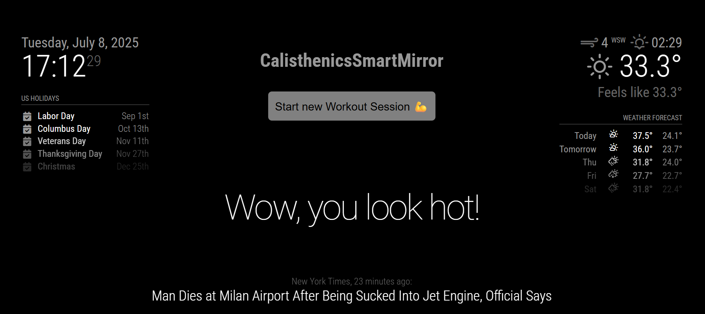
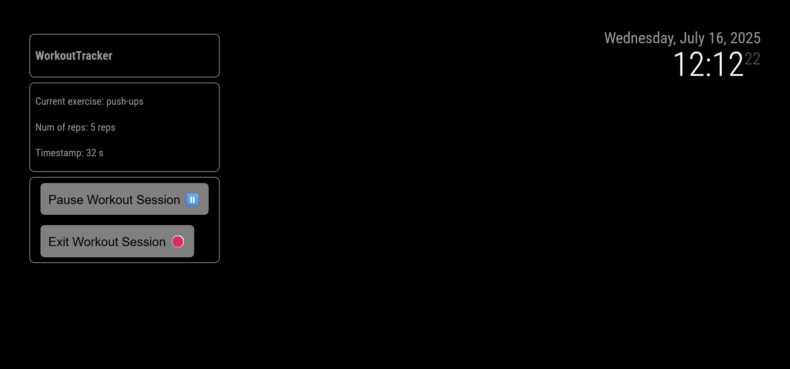
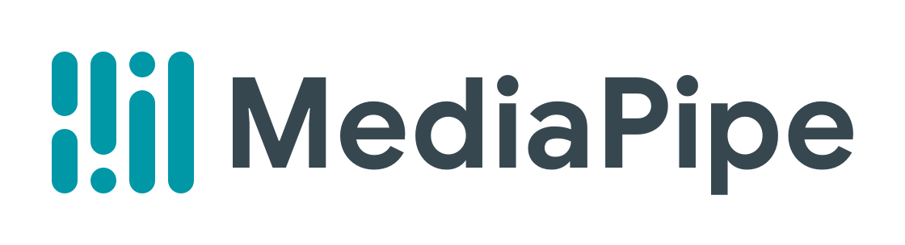

# Calisthenics SmartMirror
## A powerful embed tool to film track your workout sessions with AI.
Made by Younes Bendimerad, Lennard Gross and Philip Synowiec




### Installing and running

You can clone the repository:
```
git clone https://github.com/ixodev/magicmirror.git
cd magicmirror
```

Upgrade the installed node_modules and run (Node.js is required)
```
npm install
npm run server
```

The config/config.js file sets up the port as 8080 but you can set it as you like it.
Please go to the <a href="https://docs.magicmirror.builders/configuration/introduction.html"> MagicMirror² documentation for details</a>.

### Frameworks used for this project

Mediapipe from Google, see <a href="https://www.github.com/PhilipSynowiec/WorkoutTracker">this repo</a> for details


MagicMirror²


And others, such as TensorFlow, Keras, etc.